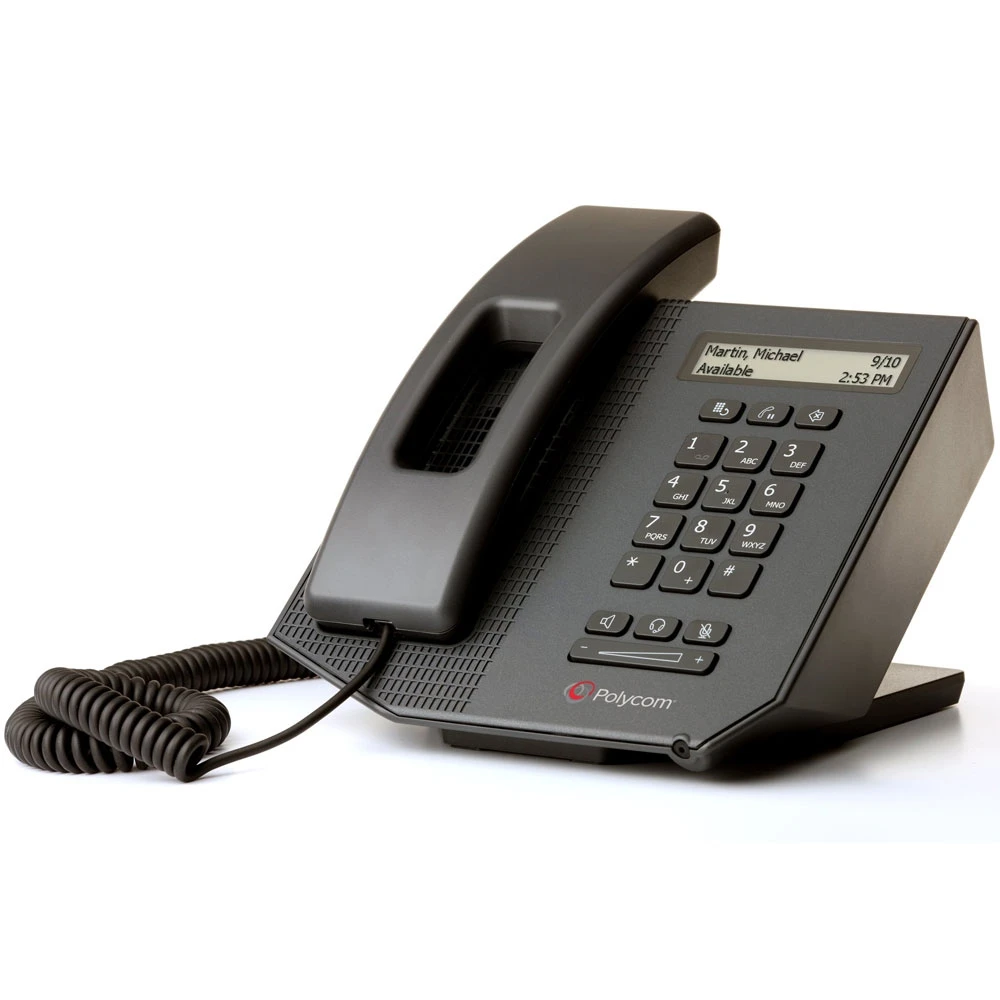

# Agent Phone

<p align="center">
  
  
</p>

**A desk phone as a physical attention surface for your AI coding agents.**

You're running four agent sessions in four terminals. They're all off
thinking. You minimized them. Which one needs you? The one that made the
desk phone's light blink.

- **`#`** — bind the phone to the currently focused terminal. Repeat for
  every session you're juggling, then minimize them all.
- **Lamp blinks red** — a bound terminal finished its turn and is waiting
  on you. Steady orange means agents are working; green means all clear.
- **`*`** — bring the terminal that needs attention to the front; keep
  pressing to cycle. Digits `1`–`9` jump straight to a terminal.
- **Pick up the receiver** — the handset mic becomes your prompt box.
  Talk, hang up, read the transcript, press Redial to send.
- **Headset** — the other way to dictate. Press to record the Mac's
  current microphone, press again to paste. The phone lights that
  button's lamp while the route is active.

No PBX, no cloud telephony, no browser extension. One daemon on your Mac
and a $20-on-eBay desk phone.

## Quick start

```sh
brew install hidapi ffmpeg whisper-cpp
git clone https://github.com/SJM7/agent-phone.git && cd agent-phone
uv sync
DYLD_LIBRARY_PATH=/opt/homebrew/lib uv run python -m agent_phone.daemon
```

Plug in the phone (driverless), grant the macOS permission prompts as they
appear, add the hooks for the harnesses you use, and press `#`. The full
walkthrough — including the whisper model download and every permission —
is in [Getting started](docs/getting-started.md).

## Documentation

| Guide | What it covers |
|---|---|
| [Getting started](docs/getting-started.md) | shipping box to dictation: prerequisites, daemon, macOS permissions, hooks, troubleshooting |
| [Claude Code setup](docs/claude-code-setup.md) | hook configuration and native dictation |
| [Grok Build setup](docs/grok-setup.md) | hook configuration, native F8, and local Whistle |
| [Codex setup](docs/codex-setup.md) | hook configuration and local dictation |
| [Hermes setup](docs/hermes-setup.md) | shell hooks and the turn-end debounce |
| [VVX phone setup](docs/phone-setup.md) | the SIP backend for network phones |
| [CX300 HID protocol](docs/cx300-hid-protocol.md) | the reverse-engineered protocol, with provenance and credits |
| [CX300 HID descriptor](docs/cx300-hid-descriptor.md) | first public annotated dump of the report descriptor, plus probe results |

## Supported harnesses

Agent Phone works with the major agent harnesses side by side — the daemon
detects which one lives in each terminal (from its tty's process list, so
even a fresh terminal picks the right mode) and adapts:

| | [Claude Code](https://claude.com/claude-code) | [Grok Build](https://x.ai) | [Codex CLI](https://developers.openai.com/codex) | [Hermes](https://hermes-agent.nousresearch.com) |
|---|---|---|---|---|
| Lamp on turn finished | `Stop` hook | `Stop` hook (`end_turn` only) | `Stop` hook | `post_llm_call` + settle debounce |
| Session linking | `UserPromptSubmit` hook | `UserPromptSubmit` hook | `UserPromptSubmit` hook | `pre_llm_call` / `pre_tool_call` |
| Receiver dictation | native dictation (Space held for you) | native F8, or local Whistle paste with `--stt whistle` | local paste (whisper.cpp, or Whistle with `--stt whistle`) | local paste (whisper.cpp, or Whistle with `--stt whistle`) |
| Setup | [guide](docs/claude-code-setup.md) | [guide](docs/grok-setup.md) | [guide](docs/codex-setup.md) | [guide](docs/hermes-setup.md) |

All four pass hook payloads as JSON on stdin with the same core fields, so
one tiny hook script serves them all. The headset button is the same on
every harness: it records the Mac's default input and pastes. It does not
hold Space or F8.

## The keypad

Bindings last for the current daemon session. After a restart, press `#`
to bind each terminal again.

| Control | Action |
|---|---|
| `#` | bind the focused terminal |
| `*` | next terminal needing attention; browses all bound terminals when quiet |
| `1`–`9` | speed dial: jump straight to the Nth bound terminal |
| `0` | minimize every bound terminal |
| Redial | press Enter in the focused terminal (send the dictated prompt) |
| Hold | press Escape (interrupt a running agent) |
| Delete | clear the input line (Ctrl+U) |
| Receiver | dictate into the phone mic; hang up to finish |
| Headset | Mac's current microphone (AirPods when that is the default); press again to paste. The phone lights this button's lamp |
| Mute | hardware-mutes the handset mic mid-dictation |
| Lamp | blinking red: needs you; steady orange: agents working; green: all clear |

The full loop never touches the keyboard: lamp blinks, `*`, read, dictate
(lift and hang up, or press Headset twice), Redial. The phone stays
silent — there is no ringtone.

## How it works

The daemon (`python -m agent_phone.daemon`) is plain Python. Terminal
windows are tracked and focused through macOS Automation (Terminal.app and
iTerm2), and each agent session announces itself over two hooks: *turn
started* and *turn finished*. The display shows a live dashboard — latest
event, who's next, waiting and bound counts — with a spinner ticking while
agents work.

The phone side is pluggable, because "old desk phone" comes in two species:

- **USB phones — Polycom CX300** (this repo's reference hardware). Built as
  Microsoft Lync's sidecar: not a network phone at all, just a USB
  composite device — a 16 kHz speaker/mic pair plus HID for the keypad,
  hook switch, indicator lamp, and LCD. macOS enumerates it driverless.
- **SIP phones — Polycom VVX series.** The daemon embeds a minimal SIP
  registrar the phone registers to directly; the LED is driven by
  message-summary NOTIFYs and a persistent auto-answered call carries
  DTMF and handset audio. Setup: [VVX phone setup](docs/phone-setup.md).

The CX300's HID protocol is not documented by Polycom anywhere — it exists
in public because Bobbie Smulders, probonopd, OE4AMW, and Tomasz Ostrowski
reverse-engineered and preserved it. This repo carries the complete
protocol, its history, and the first public annotated report descriptor in
[docs/cx300-hid-protocol.md](docs/cx300-hid-protocol.md) and
[docs/cx300-hid-descriptor.md](docs/cx300-hid-descriptor.md), with new
findings from this project's own probing (corrected byte layouts, the
voicemail LED, host-controlled mic mute) verified on live hardware.

## Speech to text

Dictation on the receiver is chosen automatically per terminal; `--voice`
sets the fallback for windows the daemon can't identify. The headset
button is separate. It records the Mac's current default input and pastes
one transcript on the second press, on every harness. The phone lights
that button's own lamp while the route is active. The daemon does not
drive the lamp, and it does not change which device macOS has selected.

- **Claude Code, handset.** Lifting the receiver holds the push-to-talk
  key, hanging up releases it, and the transcript appears in the prompt
  for review. `--stt whistle` leaves this hold in place.
- **Grok Build, handset.** The daemon holds F8 (xAI speech-to-text) unless
  `--stt whistle`, which pastes a local transcript instead.
- **Codex and Hermes, handset.** The daemon records the phone mic and
  pastes. `--stt whisper` (the default) runs whisper.cpp after hang-up.
  `--stt whistle` transcribes during the recording and pastes once, and
  falls back to `--stt-command` if that worker fails. Audio stays on the
  machine.

## Development

An optional [browser whiteboard prototype](browser-whiteboard/README.md) adds
numbered element marks, region boundaries, and freehand sketches over live
pages, with screenshots and exports for each UI iteration. It runs independently
as an unpacked Chromium extension; the phone setup above is unchanged.

The opt-in [recorded review workflow](browser-whiteboard/README.md#recorded-reviews)
adds tab video, timestamped interactions, and bookmarked frames to handset
handoffs. Mark a moment from the review bookmark control. That command has
no default shortcut; assign one, or a USB foot pedal, at
`chrome://extensions/shortcuts`. Recording is explicitly armed for one tab;
it does not change your house styles or submit feedback automatically.

```sh
uv run --group dev pytest
```

Python 3.11+, stdlib-only runtime (plus `hidapi`).

## License

[PolyForm Noncommercial 1.0.0](LICENSE.md): use it, study it, fork it, run
it on your own desk — anything noncommercial. Commercial use of this code
requires a separate license from the author.

The protocol documentation in
[docs/cx300-hid-protocol.md](docs/cx300-hid-protocol.md) and
[docs/cx300-hid-descriptor.md](docs/cx300-hid-descriptor.md) is
additionally released under
[CC BY 4.0](https://creativecommons.org/licenses/by/4.0/) — it preserves
community reverse-engineering and should stay as free as the work it
builds on.
